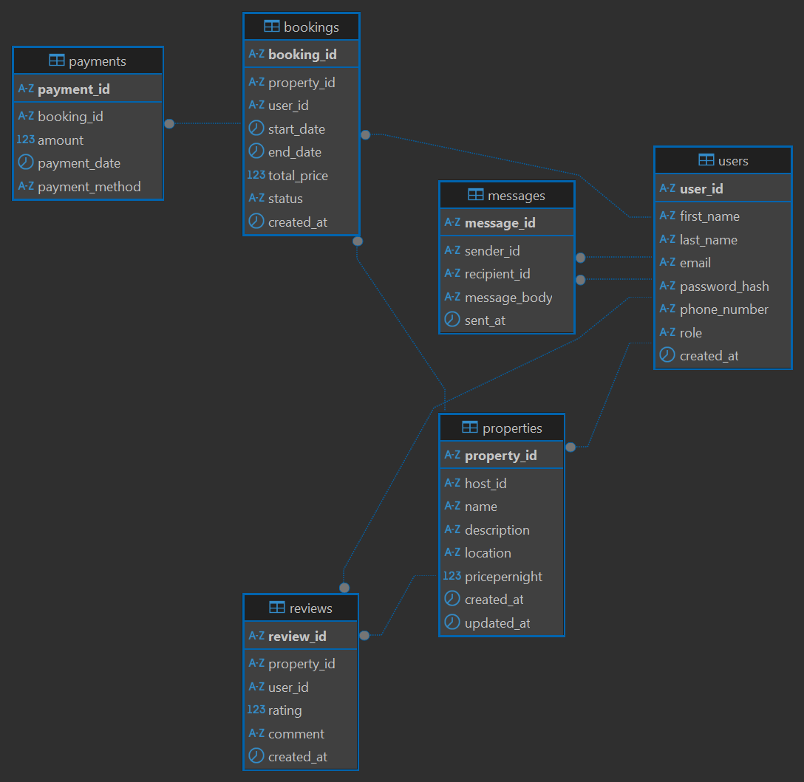

# AirBnB Database ER Diagram

## 📌 Objective
To design and document an Entity-Relationship Diagram (ERD) for the AirBnB database system. The ERD visually represents the structure of the database, including entities, attributes, relationships, and constraints as specified.

---

## 🧱 Entities and Attributes

### 1. User
- `user_id`: UUID, Primary Key, Indexed
- `first_name`: VARCHAR, NOT NULL
- `last_name`: VARCHAR, NOT NULL
- `email`: VARCHAR, UNIQUE, NOT NULL
- `password_hash`: VARCHAR, NOT NULL
- `phone_number`: VARCHAR, NULL
- `role`: ENUM (`guest`, `host`, `admin`), NOT NULL
- `created_at`: TIMESTAMP, DEFAULT CURRENT_TIMESTAMP

### 2. Property
- `property_id`: UUID, Primary Key, Indexed
- `host_id`: UUID, Foreign Key → User(`user_id`)
- `name`: VARCHAR, NOT NULL
- `description`: TEXT, NOT NULL
- `location`: VARCHAR, NOT NULL
- `pricepernight`: DECIMAL, NOT NULL
- `created_at`: TIMESTAMP, DEFAULT CURRENT_TIMESTAMP
- `updated_at`: TIMESTAMP, ON UPDATE CURRENT_TIMESTAMP

### 3. Booking
- `booking_id`: UUID, Primary Key, Indexed
- `property_id`: UUID, Foreign Key → Property(`property_id`)
- `user_id`: UUID, Foreign Key → User(`user_id`)
- `start_date`: DATE, NOT NULL
- `end_date`: DATE, NOT NULL
- `total_price`: DECIMAL, NOT NULL
- `status`: ENUM (`pending`, `confirmed`, `canceled`), NOT NULL
- `created_at`: TIMESTAMP, DEFAULT CURRENT_TIMESTAMP

### 4. Payment
- `payment_id`: UUID, Primary Key, Indexed
- `booking_id`: UUID, Foreign Key → Booking(`booking_id`)
- `amount`: DECIMAL, NOT NULL
- `payment_date`: TIMESTAMP, DEFAULT CURRENT_TIMESTAMP
- `payment_method`: ENUM (`credit_card`, `paypal`, `stripe`), NOT NULL

### 5. Review
- `review_id`: UUID, Primary Key, Indexed
- `property_id`: UUID, Foreign Key → Property(`property_id`)
- `user_id`: UUID, Foreign Key → User(`user_id`)
- `rating`: INTEGER (1 to 5), NOT NULL
- `comment`: TEXT, NOT NULL
- `created_at`: TIMESTAMP, DEFAULT CURRENT_TIMESTAMP

### 6. Message
- `message_id`: UUID, Primary Key, Indexed
- `sender_id`: UUID, Foreign Key → User(`user_id`)
- `recipient_id`: UUID, Foreign Key → User(`user_id`)
- `message_body`: TEXT, NOT NULL
- `sent_at`: TIMESTAMP, DEFAULT CURRENT_TIMESTAMP

---

## 🔗 Relationships

| From        | To           | Type             | Description                             |
|-------------|--------------|------------------|-----------------------------------------|
| User        | Property     | 1 : N            | A host (user) can own multiple properties |
| User        | Booking      | 1 : N            | A user can make multiple bookings        |
| Property    | Booking      | 1 : N            | A property can be booked multiple times  |
| Booking     | Payment      | 1 : 1            | One payment is associated per booking    |
| User        | Review       | 1 : N            | A user can leave multiple reviews        |
| Property    | Review       | 1 : N            | A property can receive multiple reviews  |
| User        | Message      | 1 : N (sender)   | A user can send many messages            |
| User        | Message      | 1 : N (recipient)| A user can receive many messages         |

---

## ✅ Constraints and Indexing

### User
- Unique constraint on `email`
- Non-null constraints on required fields

### Property
- Foreign key: `host_id` → `users(user_id)`
- Non-null for all essential fields

### Booking
- Foreign keys: `property_id`, `user_id`
- Enum constraint on `status` (`pending`, `confirmed`, `canceled`)

### Payment
- Foreign key: `booking_id`

### Review
- Foreign keys: `property_id`, `user_id`
- Rating constrained between 1 and 5

### Message
- Foreign keys: `sender_id`, `recipient_id`

### Indexes
- Primary keys are indexed by default
- Additional indexes:
  - `email` in `users`
  - `property_id` in `properties`, `bookings`
  - `booking_id` in `bookings`, `payments`

---

## 🖼 ERD Diagram

> The ERD was generated using **DBeaver** and exported as a PNG image. It illustrates all entities, attributes, relationships, primary/foreign keys, and constraints.

---

## 🛠 Tool Used

- **Tool**: [DBeaver](https://dbeaver.io/)
- **Export Format**: `PNG`
- **Location**: `ERD/airbnb-erd.png`

---