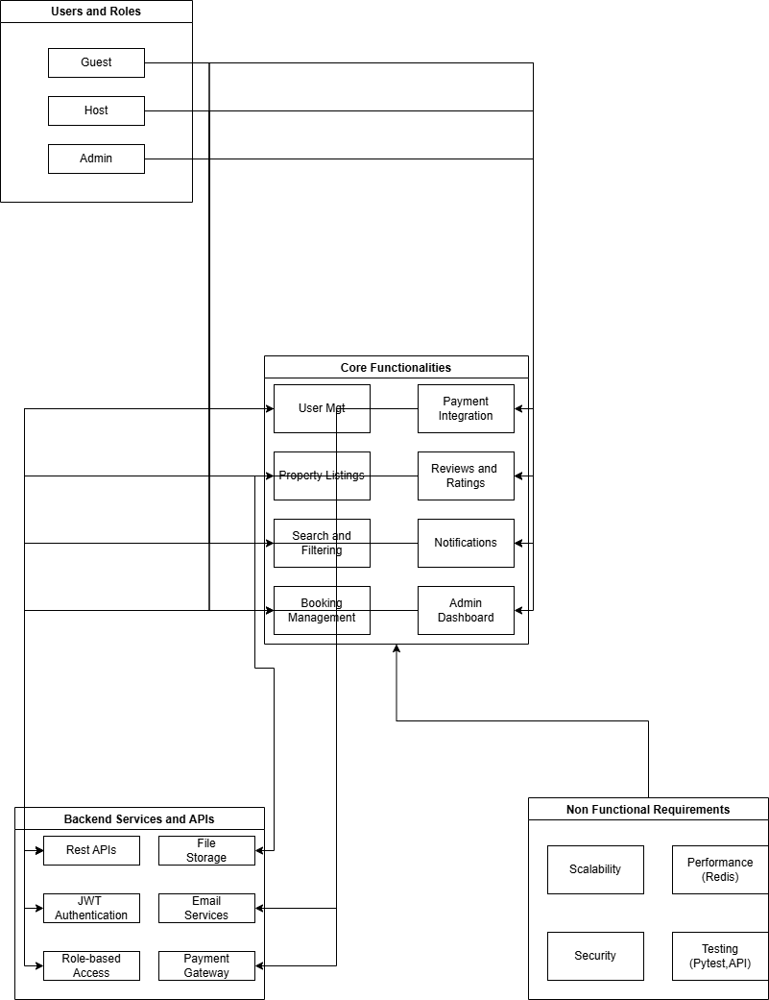

# 🧩 Airbnb Clone – Backend Features and Functionalities

This document outlines the core features, technical requirements, and non-functional expectations of the Airbnb Clone's backend system. It serves as a blueprint for the development, documentation, and review of key functionalities and supporting services required to build a scalable rental marketplace.

---

---

## 🔑 Core Functionalities

These are the key modules that the backend must implement to support Airbnb-like functionality:

1. **User Management**
   - Registration and login (JWT)
   - OAuth (Google, Facebook)
   - Profile updates and preferences

2. **Property Listings Management**
   - Create, edit, and delete listings
   - Set availability and pricing
   - Upload property images

3. **Search and Filtering**
   - Search properties by location, price, amenities, guest capacity
   - Pagination for large result sets

4. **Booking System**
   - Book properties with date validation
   - Cancel bookings based on policy
   - Track status (pending, confirmed, canceled)

5. **Payment Integration**
   - Secure payment processing (Stripe, PayPal)
   - Multi-currency support
   - Host payouts

6. **Reviews and Ratings**
   - Guests review properties after completed stays
   - Hosts respond to feedback
   - One review per booking (to prevent spam)

7. **Notifications**
   - Email/in-app alerts for booking status, payments, cancellations

8. **Admin Dashboard**
   - View and manage users, properties, bookings, and payments

---

## 🛠️ Technical Requirements

- **Database**: MySQL or PostgreSQL
- **API**: RESTful endpoints (optionally GraphQL)
- **Authentication**: JWT sessions, OAuth, RBAC for role-based access
- **Storage**: Cloud file storage for images (e.g., AWS S3, Cloudinary)
- **Email Service**: SendGrid, Mailgun, or similar
- **Validation**: Global error handling and input sanitization

---

## 🚀 Non-Functional Requirements

| Feature         | Description                                                                 |
|----------------|-----------------------------------------------------------------------------|
| **Scalability** | Modular architecture, load balancers for horizontal scaling                |
| **Security**    | JWT encryption, rate limiting, password hashing                            |
| **Performance** | Redis caching, optimized DB queries                                         |
| **Testing**     | Unit/integration tests with frameworks like Pytest, Postman for API tests   |

---

## 🖼️ Visual Diagram

The image below visualizes the relationship between users, backend services, and system functionalities.

